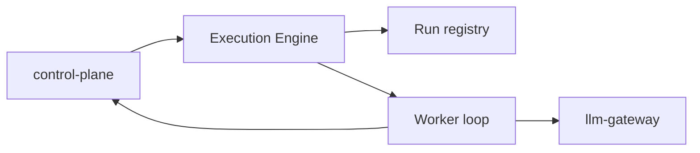

# Execution Engine Architecture

The execution engine is the run worker responsible for:

1. accepting run requests from the control plane
2. enforcing idempotent run lifecycle behavior
3. fetching bootstrap and context from the control plane
4. running the reasoning loop
5. streaming events and final commit back to the control plane
6. delegating LLM and tool access to the gateway

## High-Level Diagram



## Detailed Diagram

```mermaid
flowchart TD
    subgraph API[Service Entry]
        FastAPI[execution_engine/app.py]
        StartRun[POST /api/v1/runs]
        CancelRun[POST /api/v1/runs/{run_id}/cancel]
        Health[health + readiness + metrics]
    end

    subgraph Runtime[Run Runtime]
        Registry[run_registry.py]
        Worker[worker.py]
        Engine[agent/engine.py]
        Tools[agent/tools.py]
        Events[event manager / event emission]
    end

    subgraph Integrations[Service Clients]
        OrchClient[orchestrator_client.py]
        GatewayClient[gateway_client.py]
    end

    subgraph External[External Systems]
        CP[control-plane]
        GW[llm-gateway]
    end

    FastAPI --> StartRun
    FastAPI --> CancelRun
    FastAPI --> Health

    StartRun --> Registry
    CancelRun --> Registry
    Registry --> Worker
    Worker --> Engine
    Engine --> Tools
    Worker --> Events

    Worker --> OrchClient
    Worker --> GatewayClient
    Tools --> GatewayClient

    OrchClient --> CP
    GatewayClient --> GW
```

## Primary Responsibilities

1. maintain queued, running, and terminal run state
2. fetch authoritative execution snapshots and chat context from control-plane
3. run the agent reasoning loop and handle tool-call iterations
4. emit ordered run events and final completion payloads
5. avoid direct provider secret handling by using llm-gateway
